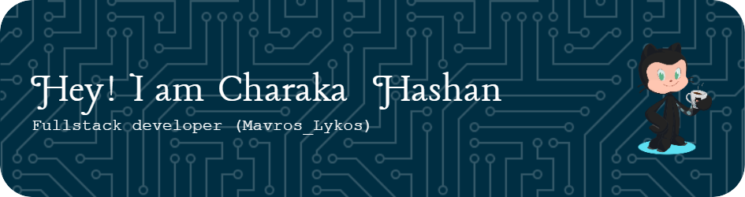

## Hi there 👋

    

  

 
   
<!--
**Mavros-Lykos/Mavros-Lykos** is a ✨ _special_ ✨ repository because its `README.md` (this file) appears on your GitHub profile.

Here are some ideas to get you started:

- 🔭 I’m currently working on ...
- 🌱 I’m currently learning ...
- 👯 I’m looking to collaborate on ...
- 🤔 I’m looking for help with ...
- 💬 Ask me about ...
- 📫 How to reach me: ...
- 😄 Pronouns: ...
- ⚡ Fun fact: ...
-->
  <!-- -->
  

  
 
  <!-- visiters count API -->

### 
I'm Charaka Hashan, a part-time full-stack freelance developer 👨‍💻 working remotely since 2024 🚀
  
  

- 🔭 I’m currently working on [Emotional Roller Coaster](https://github.com/Mavros-Lykos/Emotional-Roller-Coaster-gamedevjs-2025)
  

- 🌱 I’m currently learning React and Next.js  
  

- ❓ Ask me about anything related to LAMP stack and related technologies  
  

- ⚡ Fun fact: I use tabs over spaces  
  

   

## My Skill Set 

 

 
<table><tr><td valign="top"  align="center" width="33%">

### Frontend  
<table align="center">
  <tr>
    <td></td>
    <td></td>
  </tr>
  <tr>
    <td></td>
    <td></td>
  </tr>
  <tr>
    <td></td>
    <td></td>
  </tr>
  <tr>
    <td></td>
    <td></td>
  </tr>
  <tr>
    <td></td>
    <td></td>
  </tr>
  <tr>
    <td></td>
    <td></td>
  </tr>
  <tr>
    <td></td>
    <td></td>
  </tr>
</table>

</td><td valign="top" width="33%">

### Backend  
<table align="center">
  <tr>
    <td></td>
    <td></td>
  </tr>
  <tr>
    <td></td>
    <td></td>
  </tr>
  <tr>
    <td></td>
    <td></td>
  </tr>
  <tr>
    <td></td>
    <td></td>
  </tr>
  <tr>
    <td></td>
    <td></td>
  </tr>
  <tr>
    <td></td>
    <td></td>
  </tr>
  <tr>
    <td></td>
    <td></td>
  </tr>
</table>

</td><td valign="top" width="33%">

### DevOps  
<table align="center">
  <tr>
    <td></td>
    <td></td>
  </tr>
  <tr>
    <td></td>
    <td></td>
  </tr>
  <tr>
    <td></td>
    <td></td>
  </tr>
</table>

</td></tr></table>  

   

 
  
  
  

<!-- daily strake api -->

 
 
  

 

<!-- daily strake api -->
 
<!-- top languages api -->

<!-- top languages api-->

<!-- Activity Graph API-->

<!-- Activity Grapho API-->

